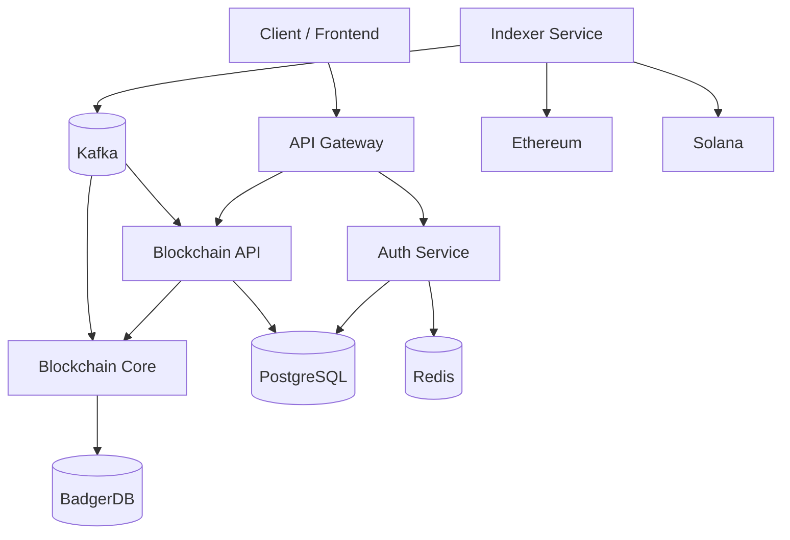

# ChainForge

> Production-grade Web3 backend platform built with Golang microservices for blockchain infrastructure, on-chain indexing, and distributed systems.

## Overview

ChainForge is an educational and production-inspired project that demonstrates modern backend and blockchain engineering practices using Go.

The platform is designed around a microservice architecture and focuses on:

* Custom blockchain implementation
* Wallets and transaction processing
* Ethereum & Solana data indexing
* Token price tracking and alerts
* Secure authentication and authorization
* Event-driven distributed systems

---

## Vision

ChainForge aims to showcase:

* Blockchain fundamentals (PoW → PoS evolution)
* Cryptographic signing and wallet management
* High-performance indexing pipelines
* Real-time token pricing services
* Scalable Golang microservices
* Event-driven architectures using Kafka
* Production-ready deployment workflows

---

## Tech Stack

| Category         | Technology                         |
| ---------------- | ---------------------------------- |
| Language         | Go (Golang)                        |
| Architecture     | Microservices + Clean Architecture |
| API Layer        | REST + gRPC                        |
| Blockchain       | Custom Chain, Ethereum, Solana     |
| Messaging        | Kafka                              |
| Database         | PostgreSQL                         |
| Cache            | Redis                              |
| Embedded Storage | BadgerDB                           |
| Security         | JWT, RBAC                          |
| DevOps           | Docker, Docker Compose             |
| Future           | Kubernetes                         |

---

## Architecture Overview

The platform follows a microservice architecture where services communicate through REST/gRPC APIs and asynchronous events.

* **API Gateway** handles external traffic.
* **Auth Service** manages authentication and authorization.
* **Blockchain API** exposes blockchain functionality.
* **Blockchain Core** maintains chain state and consensus logic.
* **Indexer Service** ingests on-chain data from external networks.
* **Kafka** distributes events across services.
* **PostgreSQL**, **Redis**, and **BadgerDB** provide persistence and caching.



---

## Repository Structure

```text
chainforge/
├── api/
│   ├── openapi/
│   └── proto/
│       ├── auth.proto
│       ├── blockchain.proto
│       └── wallet.proto
│
├── cmd/
│   ├── auth-service/
│   ├── blockchain-api/
│   ├── blockchain-core/
│   ├── gateway/
│   └── indexer-service/
│
├── internal/
│   ├── auth/
│   ├── blockchain/
│   ├── indexer/
│   ├── price/
│   └── wallet/
│
├── pkg/
│   ├── config/
│   ├── crypto/
│   ├── jwt/
│   ├── logger/
│   └── middleware/
│
├── docs/
│   ├── api.md
│   ├── architecture.md
│   └── blockchain-design.md
│
├── deployments/
│   ├── docker/
│   └── k8s/
│
├── scripts/
├── docker-compose.yml
├── Makefile
├── go.mod
├── go.sum
└── README.md
```

---

## Core Services

### API Gateway

Acts as the entry point for external clients and routes requests to internal services.

### Auth Service

Responsible for:

* User authentication
* JWT token generation
* Role-Based Access Control (RBAC)
* Security middleware

### Blockchain API

Provides public-facing blockchain endpoints and orchestrates interactions with core blockchain services.

### Blockchain Core

Implements:

* Block creation
* Chain validation
* Consensus mechanisms
* Transaction processing
* Persistent blockchain storage

### Indexer Service

Responsible for:

* Ethereum indexing
* Solana indexing
* Event processing
* Token metadata collection
* Market data ingestion

---

## Roadmap

### Phase 1 — Blockchain Core

* [x] Block structure
* [x] Blockchain implementation
* [x] Persistent storage
* [ ] Advanced consensus improvements

### Phase 2 — Wallets & Transactions

* [x] Wallet generation
* [x] Transaction model
* [ ] Transaction signing
* [ ] UTXO implementation

### Phase 3 — APIs & Services

* [x] Blockchain API
* [x] Authentication Service
* [x] JWT Authentication
* [x] RBAC Foundations
* [ ] Full gRPC Integration

### Phase 4 — Indexing & Pricing

* [ ] Ethereum Indexer
* [ ] Solana Indexer
* [ ] Token Price Service
* [ ] Price Alerts & Notifications

### Phase 5 — Production Infrastructure

* [ ] Kafka Event Streaming
* [ ] PostgreSQL Persistence Layer
* [ ] Redis Caching
* [ ] Dockerized Services
* [ ] Kubernetes Deployment

---

## Getting Started

### Clone Repository

```bash
git clone https://github.com/FANIMAN/ChainForge.git
cd ChainForge
```

### Install Dependencies

```bash
go mod tidy
```

### Run Services

Example:

```bash
go run cmd/blockchain-api/main.go
```

or

```bash
go run cmd/auth-service/main.go
```

---

## Current Status

🚧 Active Development

ChainForge is being developed incrementally in public, with each feature documented and committed as a real-world engineering exercise.

Current focus:

* Indexing infrastructure
* Pricing services
* Authentication improvements
* Distributed architecture patterns

---

## Goals

* Learn advanced Golang backend development
* Build production-ready blockchain systems
* Practice distributed systems design
* Demonstrate software engineering best practices
* Create a portfolio-quality Web3 project

---

## Contributing

Contributions, ideas, bug reports, and discussions are welcome.

1. Fork the repository
2. Create a feature branch
3. Commit your changes
4. Open a pull request

---

## License

MIT License
